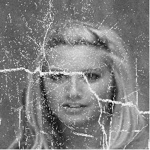
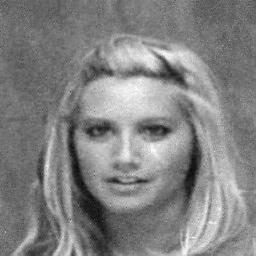

### Image restoration using the Pix2Pix [1] cGan and U-net [2] networks 

Pix2Pix network is used for image inpaiting.
Afterwards, back-to-back U-net networks are used for denoising and deblurring effect. 

#### References:

[1] https://arxiv.org/pdf/1611.07004.pdf

[2] https://arxiv.org/pdf/1505.04597.pdf


#### Examples:


<p float="left">
  
   
  
   
</p>


### Requirements 
```
Python (suggested 3.7.1)  
Numpy   
os-sys  
OpenCv  
Tensorflow (suggested 2.4.0)  